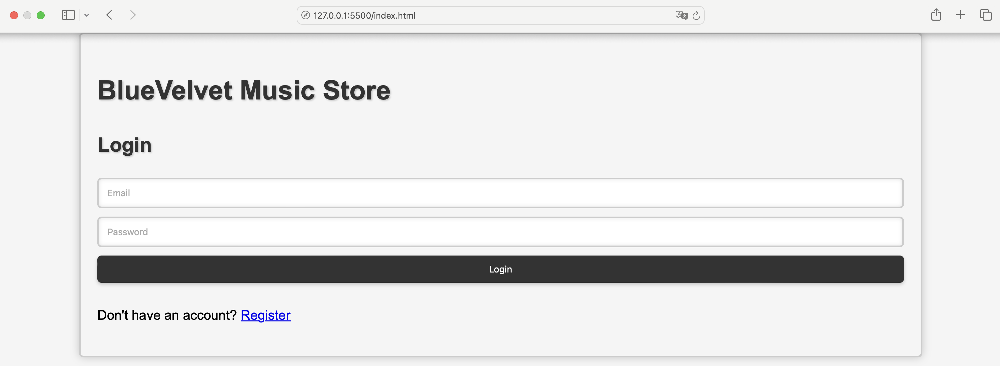
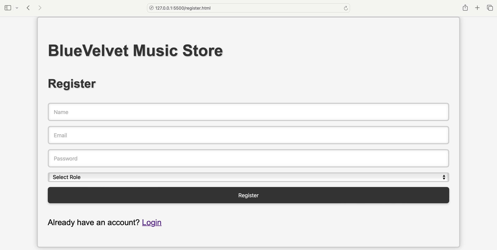
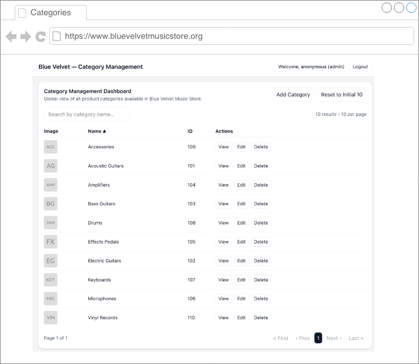
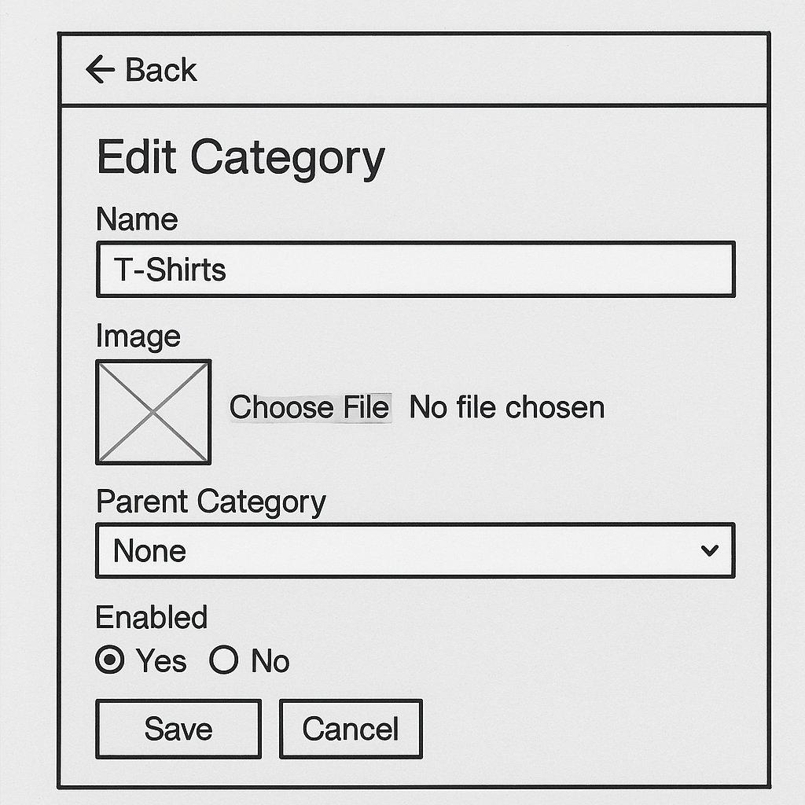
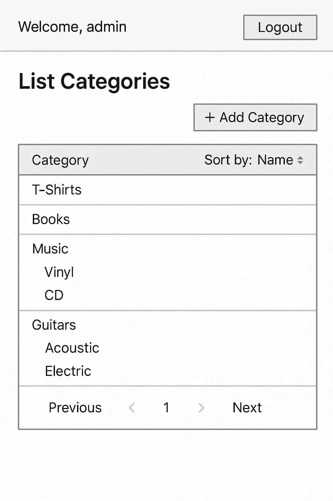
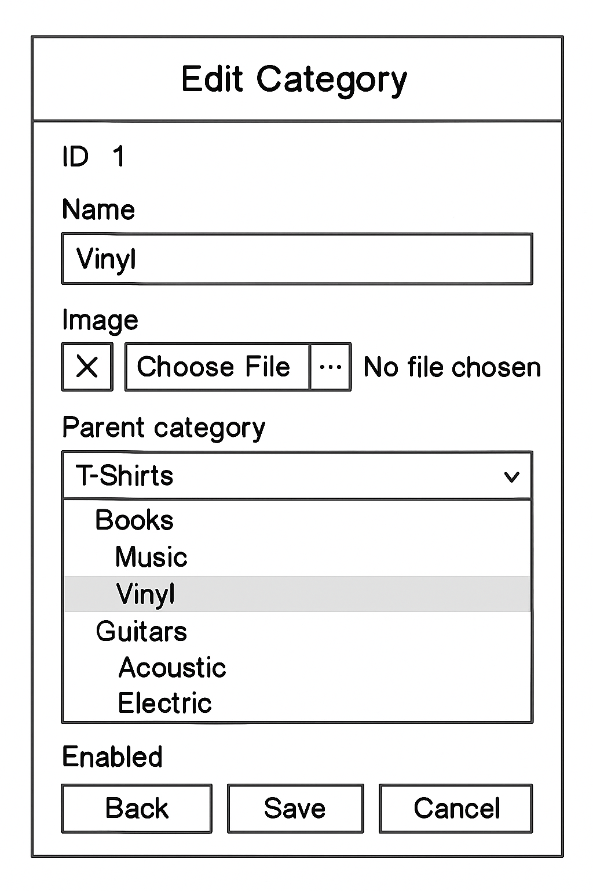
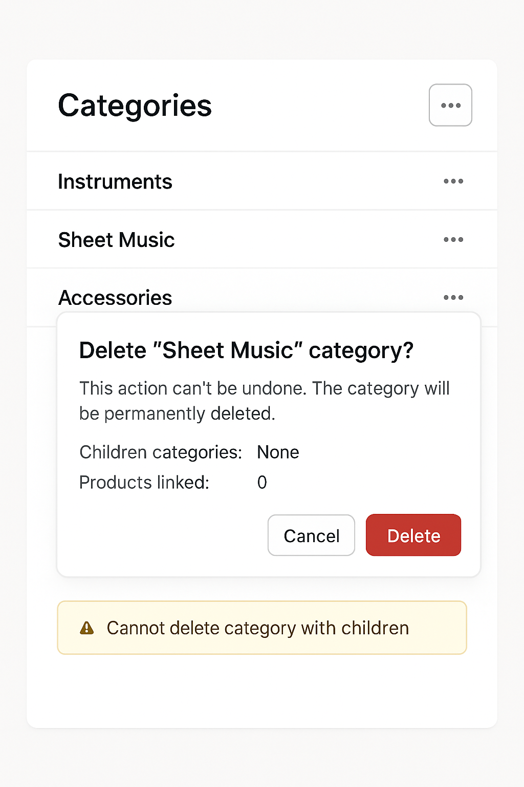

# Term assignment: Full-stack web application for managing product categories in the Bluevelvet Music Store.

A front-end web application for managing product categories in the BlueVelvet Music Store, built using vanilla HTML, CSS, and JavaScript.

This frontend may be used as a starting point for the term assignment for the Application Lifecycle Management course, taught by Rodrigo Martins Pagliares at the undergraduate Computer Science course at UNIFAL-MG - Alfenas - MG - Brazil.

You can try this frontend web application without a backend application and a database server. The frontend in this repository is self-contained and can be used to perform simple CRUD operations on a categories table upon logging in. The data is stored and retrieved from LocalStorage. New users can register themselves.

## What the students neeed to do in this assignment?

- Implement a full stack web application for product categories (CRUD) for the administrator module of BlueVelvet Music Store
- The backend must be implemented using Spring Boot
- You can choose the technologies used for the frontend: (i) use the frontend described in this repository (vanilla HTML, CSS e Javacript communication with a RESTful API in the backend, (ii) Using a template engine like Thymeleaf to generate the views for the frontend (strategy used in the videos by Prof. Fellipe Rey), and (iii) Using a JavaScript library like React for the frontend communicating with the backend using valilla JavaScript and/or some library for asynchronous communication with the backend (e.g, axios)

## Technologies I suggest you use in this assignment 

These are the **backend** technologies I suggest you use when developing your solution:   
- Spring Boot
- MySQL or an embedded (in memory) database
- Thymeleaf + HTML + CSS + Javascript (if you decide to use a template engine with for dynamic generation of web page on the server) 
- Traditional MVC or REST controller when using a template engine such as Thymeleaf or REST controller for a decoupled frontend (see frontend technologies below). 

These are the **frontend** technologies I suggest you if you decide to **not use a template engine such as Thymeleaf**   
- HTML
- Vanilla CSS (without CSS libraries such as BootStrap pr TailWind)
- Vanilla JavaScript (without libraries\frameworks such as vue or React)
- JavaScript/CCS Libraries (bootstrap, React, etc)

## Definition of DONE (Scrum)

The user stories are considered completed if:
- They meet the acceptance criteria;
- They "crosses" all layers within the application (web user interface, controller, service, repository, resource/database)
- They are decoupled from backend 
- The view layer must fully responsive (responsive layout).

## User stories TO BE implemented in this assignment (2025/02)

| # | ID | DESCRIPTION |
|----------|----------|----------|
| 01    | US-1232   | Login      |
| 02    | US-1603   | Register new users     |
| 03    | US-2032   | Access the Category Management Dashboard     |
| 04    | US-1306   | Create category of products      |
| 05    | US-0907   | List categories of products     |
| 06    | US-2100   | List products within a category for the online shopper |
| 07    | US-1307   | Edit category of products     |
| 08    | US-0904   | Delete category of products    |
| 09    | US-0913   | Sort category of products     |
| 10    | US-0914   | Filter category of products     |
| 11    | US-0916   | Export category of products     |

## Requirements  

 ### US-1232: Login  

"As an Administrator I want to login in the BlueVelvet Music Store application with my registered account in order to manage all products sold by the company."

Acceptance criteria:

- A login has an e-mail address and a password.
- there must be an explicit option tor remember the administrator credentials
- An incorrect login message must be shown for incorrect email and/or password. Suggestion: "Incorrect email or password. Please try again"
- The password must be at least 8 characters long
- There must be an option allowing new administrators to create an account. Suggestion: "Don't have an account? Register"

**Figure 5:** US-1232 - Login Screen  

 ### US-1603: Register new users  

"As an administrator I want to register new users in BlueVelvet Music Store application to allow multiple people to work collaboratively and perform their responsibilities in the company"

Acceptance criteria:

- Only administrators can register new users.
- A user must have a role.
- 5 User (admin) roles: Administrator, Sales Manager, Editor,, Assistant, Shipping Manager
- A user has an e-mail address and a password.
- A message "Already have an account? Login" must be presented to allow returnin to the login page.

**Figure 2:** US-1603 - Register new users  

### US-2032: Access the Category Management Dashboard 

"As an Administrator I want to access the Category Management Dashboard to manage all categories, including listing all categories in order to have a global view of all categories of products available in Blue Velvet Music store."

Acceptance criteria:

- Only authenticated users in the role orf admin, salesperson or shipper can access the dashboard.
- The dashboard, among other things, contains  a list categories.
- A message showing the logged-in user should be presented: "Welcome,{username} (role)
- if a user tries to access the dashboard page without logging in then an error page is displayed.
- An option to logout of this page must be presented for security reasons. After clicking logout, the login form must be presented (See US 1351 and 1358)
- The list of categories may be too long. Provide a way for navigation (e.g. pagination for the categories list)
- By default, it must be possible to see 10 categories per page (pagination)
- Pagination is based on categories names 
- Pagination should work well with sorting 
- Sort by category name and ID
- Default sorting by name, ascending order
- Filter: search by category name 
- The fields main image and category name must be shown
- To see category details, see US-1045
- From the dashboard it must be possible to add, view deails, delete, and edit category information.
- There must be an option to reset the category list to it's initial state (to facilitate testing, there will be 10 categories initially created when first running the application of after selecting the option reset the cartegories list.

**Figure 3:** US-202 - Access the Category Management Dashboard 

### US-1306: Create category of products 

"As an Administrator I want to create a category for a product in order to better organize the products sold by Blue Velvet Music Store."

Acceptance criteria:

- Only authenticated users in the role orf admin can manage categories.
- A category has an ID,  a name (unique), an image representing the category and a parent category if it is not a top-level(root) category
     - parent_id: refers to ID of parent category, or null if it is the top-level category (no parent)
- A category may have many children categories
- Only image file name are stored. The actual image file is stored on the file system (dev) or Amazon S3 (production)
- The Administrator can enable/disable a category
- Some (not limited) categories: T-Shirts, Vinyl, CD, MP3, Books, Acoustic Guitar

Create a script/program to import sample categories/subcategories information into the databasse for testing purposes.

Unit tests:
- Test creating top-level (root) categories
- Test creating sub categories
- Test getting a category and its children
- Test printing categories in hierarchical form

 
**Figure 4:** US-1306: Create category of products 

### US-0907: List categories of products 

"As an Administrator I want to listt all categories of products in order to have a global view of all categories of products sold by Blue Velvet Music Store"

Acceptance criteria:

- Only authenticated users in the role orf admin or editor can manage categories.
- If the list of categories is too long, provide a way for navigation (e.g. pagination for the categories list)
 - By default, it must be posible to see 5 top level categories per page (pagination)
- Pagination is based on top-level categories (sub categories not counted)
- Administrators may sort categories name in ascending or descending order. Sorted by root categories first, then by sub categories
- Pagination should work well with sorting 

Note: Make Categories Page Fully Responsive

**Figure 5:** US-0907 - List categories of products

### US-2100: List products within a category for the online shopper  

"As an Online shopper I want to list all of products witin a category in order to have a global view of all products sold, by category, on Blue Velvet Music store"

Acceptance criteria:

- Show only enabled categories
- Show enabled sub categories (sorted by name ascending)
- Categories are sorted by name in alphabetical order
- Show breadcrumb: Home / Music /mp3
- List is paginated (10 categories per page)

### US-1307: Edit category of products 

"As an Administrator I want to edit an existing category of products to improve the information of the categories of products sold by Blue Velvet Music Store"

Acceptance criteria:

- Only authenticated users in the role of admin can manage categories.
- All fields of a category may be updated.  
- If new image is uploaded, delete the old one
- If no image is uploaded, do nothing with current image
- In edit mode, category image is not required
- See US-1306 - Create Category of products - for the category fields.

**Figure 5:** US-1307: Edit category of products 

**Figure 6:** US-1307: Edit category of products 

**Figure 7:** US-1306: Create category of products 

### US-0904: Delete category of products  

"As an Administrator I want to delete a category for a product in order to better organize the products sold, by categoty, in Blue Velvet Music Store"

Acceptance criteria:

- Only authenticated users in the role orf admin or editor can manage categories.
- Only categories that have no children can be deleted.
- Also delete the category image directory

Note: Make Categories Page Fully Responsive

**Figure 5:** US-0907 - List categories of products

### US-0913: Sort category of products 

"As an Administrator I want to sort all categories of products in order to see more quickly the categories I am looking for."

Acceptance criteria:

- Only authenticated users in the role orf admin or editor can manage categories.
- Ascending, descending order

Note: Make Categories Page Fully Responsive

### US-0914: Filter category of products  

"As an Administrator I want to filter the categories of products in order to see more quickly the categories I am looking for."

Acceptance criteria:

- Only authenticated users in the role orf admin or editor can manage categories.
- Search for category names (like match – not full text search)
- Search result do not show categories in hierarchical form
- Filter should work well with sorting and paging

Note: Make Categories Page Fully Responsive

### US-0916: Export category of products  

"As an Administrator I want to export the categories of products in order to import it in a Spreadsheet for other purposes"

Acceptance criteria:

- Only authenticated users in the role orf admin or editor can manage categories.
- It must be possible to export the categories in csv format
- File name pattern: categories_2021-03-20_10-07-09.csv
- Export only two fields: id and name
- Keep hierarchical form, replace “--” by “ “ (2 whitespaces)

# Tips

This assignment complements the one used in the Web Programming course. Check its <a href="https://github.com/pagliares/product-management-bluevelvet-music-store" target="_blank"> repository</a> to get some ideas for this assignment. Note that the Web Programming repository includes a frontend example that simulates CRUD operations on products of the BlueVelvet Music Store without a backend implementation, using the JavaScript LocalStorage API to simulate persistence.

